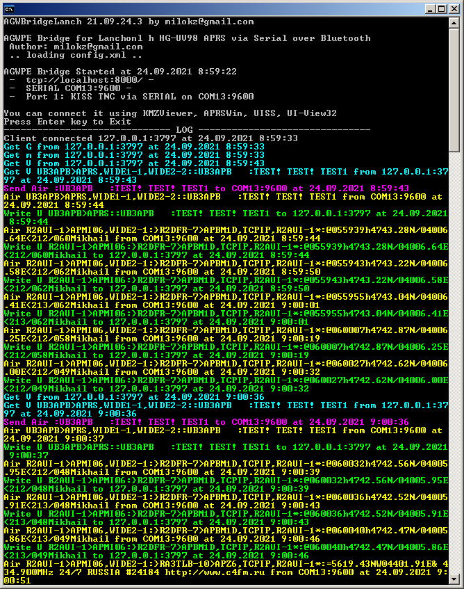
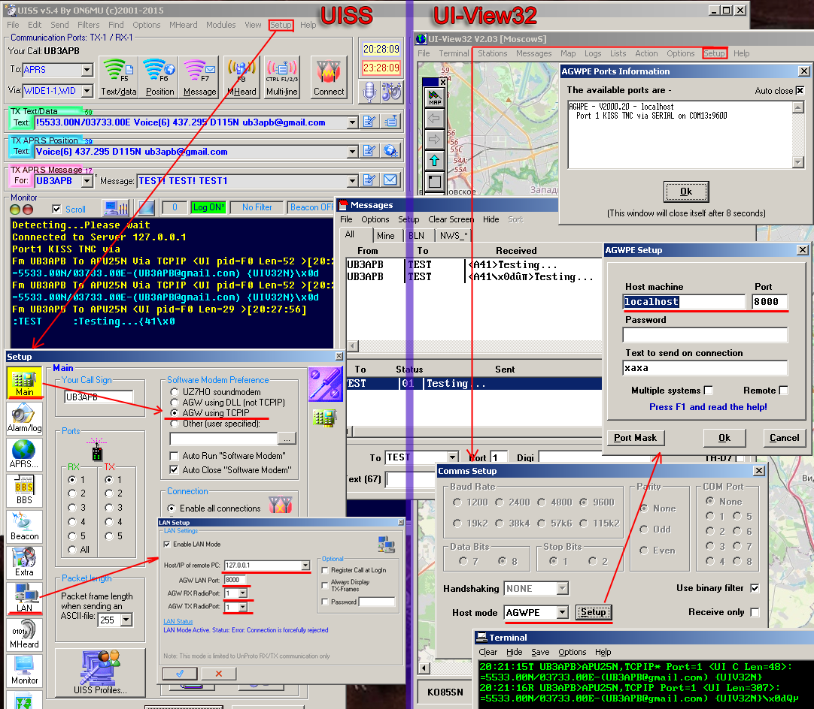

# AGW Bridge / AGW Bridge Lanch

This is a tool
to connect UISS or UI-View32 to Lanchonlh 
with AGWPE via SERIAL Bluetooth

Эта утилита позволяет подключать приложения
UISS и UI-View32 к радиостанции. Программа
эмулирует AGWPE и является мостом между
приложениями и Serial-Bluetooth подключением
к радиостанции

You can connect it using [KMZViewer](https://github.com/dkxce/KMZViewer), [APRSWin](https://github.com/dkxce/APRSWin), UISS, UI-View32    
Also you can use [APRSAir](https://github.com/dkxce/APRSAIR) in [KISS mode](https://github.com/dkxce/APRSAIR/blob/main/BIN/APRSAIR_Run_KISS_SERIAL.cmd) as Serial-Bluetooth --> APRS-Server --> APRS-Client scheme     
[Lanchonlh HG-UV98 Repository](https://github.com/dkxce/HG-UV98)     

    

